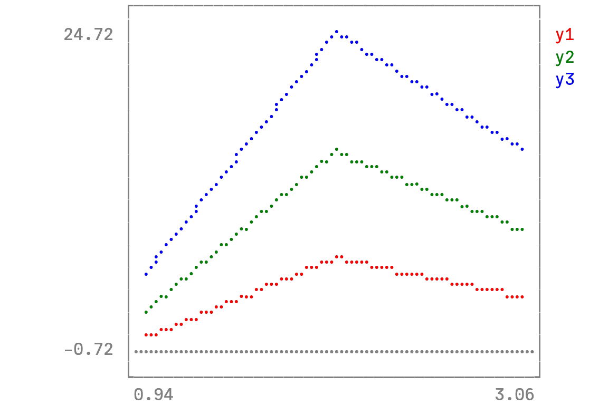

## Grupo:
Daniel Chateaubriand Lago

Kamila Santos de Camargos Ferreira Gomes

Marina Rihs Matos Wang

Pedro Henrique Assis Dornelas

Wesley dos Santos Gomes

Linguagem utilizada: Julia

## 📌 Capítulo 1: Julia 🍒

Julia é uma linguagem de alto nivel, propósito geral, e programação dinâmica, projetada para ser rápida e produtiva. 
Possui licança MIT - livre para uso, modificação e distribuição

Começou a ser desenvolvida em 2009, quando 4 estudantes se juntaram para criar uma linguagem de graça que era tanto de alto-nível quanto rápida.
O nome "Julia" não tem nenhum motivo, só acharam que era um nome bonito.
A versão estável foi lançada em 2018.

"Looks like python, feels like lisp, runs like C"
### Características:
- Expressiva (muitas operações) e pouco verbosa.
- Capaz de lidar com metaprogramação (programa manipula a si mesmo).
- Muito rápida.

### Implementação:
- Compilada JIT (Just-In-Time) - tradução de código durante execução
- Código é interpretado na primeira execução e depois otimizado para desempenho.

### Aplicações:
- Computação científica, Machine Learning, IA, Desenvolvimento web, Processamento de dados

## 🍃 Capítulo 2: Paradigmas e suas limitações

### Multiparadigma:
- Suporta programação funcional, orientada a objetos (de forma limitada) e procedural.
- Paradigma principal: múltiplo despacho (seleciona o método mais adequado com base nos tipos de todos os argumentos).

### Limitações da Orientação a Objetos:
- Não possui modificadores de acesso (public, private, protected como em Java).
- Convenção: _ no início da variável indica que algo não deve ser acessado diretamente.
- Não possui interfaces, mas podem ser simuladas com estruturas abstratas.

- Não suporta herança de classes, mas permite composição e uso de tipos abstratos com o operador <: (define subtipos).
- Não possui classes e objetos tradicionais como em Java, mas pode-se usar struct para modelar dados:
- struct: Tipo imutável (não pode modificar atributos).
- mutable struct: Tipo mutável (permite modificar atributos). (Registro)

#### 🗂️ Arquivos Relacionados:
- [Totalizavel.jl](tp%20julia/Entidades/Totalizavel.jl)
- [Produto.jl](tp%20julia/Entidades/ModProduto.jl)
- [DAO](tp%20julia/data/ModDAO.jl)

### Construtor:
- Criado dentro do próprio struct.
- Pode ser padrão (automático) ou personalizado.

#### 🗂️ Arquivos Relacionados:
- [Entidade.jl](tp%20julia/Entidades/ModEntidade.jl)

### Destrutor:
- Julia não tem destrutores explícitos.
- A desalocação de memória ocorre automaticamente pelo coletor de lixo.


## 🌺 Capítulo 3: Recursos adicionais

### Vinculação Dinâmica:
- Múltiplo despache substitui a necessidade de vinculação dinâmica tradicional.
- Métodos são escolhidos dinamicamente com base nos tipos dos argumentos.

#### 🗂️ Arquivos Relacionados:
- [Venda.jl](tp%20julia/Entidades/ModVenda.jl)

### Alocação e Desalocação:
- Feitas automaticamente

### Coletor de Lixo:
- Baseado em marcar e varrer.
- Executado automaticamente pelo runtime, mas pode ser acionado manualmente: GC.gc()
Geracional: 
- Coletores parciais são mais rápidos pois percorrem variáveis mais recentes, então rodam mais frequentemente.
- Coletores completos são mais lentos e percorrem todas as variáveis menos frequentemente.
- O coletor é lento, mas o programa prioriza evitar necessitar dele.
ex: ao definir que structs são imutáveis por padrão, encoraja o uso de structs imutáveis, que gastam menos memória.

### Tratamento de exceção: 
- Blocos try, catch, e finally 

#### 🗂️ Arquivos Relacionados:
- [MenuProduto.jl](tp%20julia/ui/ModMenuProduto.jl)
- [MenuVenda.jl](tp%20julia/ui/ModMenuVenda.jl)

### Sobrecarga:
- Através de Múltiplo despacho. 
- Ao contrário da sobrecarga, onde o programa decide qual função utilizar em tempo de compilação,
o múltiplo despacho ocorre em tempo de execução.

### Sobrescrita:
- Como não há herança, não há sobrescrita tradicional.

### Cabeçalho, Corpo e Assinatura de Funções:
Estrutura básica de uma função:

#### 🗂️ Arquivos Relacionados:
- [MenuProduto.jl](tp%20julia/ui/ModMenuProduto.jl)

### Coerção e Cast:
- Coerção de Tipos explícito (convert())

x = convert(Float64, 10)  # 10.0

- Cast Implícito (Promoção de Tipos)

x = 3 + 4.5  # Resultado é Float64 (3 promovido para 3.0)

### Subprogramas de Primeira Classe e Alta Ordem:
- Funções podem ser passadas como argumentos e retornadas como valores.

#### 📂 Arquivos Relacionados:
- [DAO.jl](tp%20julia/data/ModDAO.jl)

### Avaliação Curto Circuito:
- Operadores lógicos & e |, a expressão é avaliada toda.
- Operadores lógicos && e ||, segundo operando só é avaliado se necessário.

#### 📂 Arquivos Relacionados:
- [MenuProduto.jl](tp%20julia/ui/ModMenuProduto.jl)
- [MenuVenda.jl](tp%20julia/ui/ModMenuVenda.jl)

### Efeito colateral:
- O ! no nome da função é uma convenção em Julia para indicar que a função modifica seus argumentos.
- Funções sem o ! são chamadas funções puras e não alteram nada fora de seu escopo e sempre retorna o 
mesmo resultado para os mesmos argumentos.

#### 📂 Arquivos Relacionados:
- [DaoVenda.jl](tp%20julia/data/ModDaoVenda.jl)

### Sobrecarga de Operadores:
- Julia permite redefinir operadores para novos tipos de dados.
#### 📂 Arquivos Relacionados:
- [Produto.jl](tp%20julia//Entidades/ModProduto.jl)            

### Tipagem:
- Tipagem Dinâmica (Inferida), Explícita e paramétrica (tipos genéricos).           

#### 🗂️ Arquivos Relacionados:
- [Produto.jl](tp%20julia/Entidades/ModProduto.jl)
- [DAO.jl](tp%20julia/data/ModDAO.jl)
- [MenuProduto.jl](tp%20julia/ui/ModMenuProduto.jl)
- [MenuVenda.jl](tp%20julia/ui/ModMenuVenda.jl)


### Tuplas:
- Imutáveis e armazenam valores heterogêneos.
```
tupla = (1, "Julia", 3.14)
println(tupla[2])  # "Julia"
```

- Também podem ter tipos explícitos:
```
tupla::Tuple{Int, String, Float64} = (1, "Texto", 2.5)
```

### Uniões:
- Permite definir variáveis que aceitam múltiplos tipos.

```
struct Numero
valor::Union{Int, Float64}
end
x::Union{Int, Float64} = 10
```

### Dicionários:
- Permite criar uma tabela hash com chaves

```
Dict([("A", 1), ("B", 2)]) ou Dict("A"=>1, "B"=>2):
Dict{String, Int64} with 2 entries:
"B" => 2
"A" => 1
```

## ⭐ Capítulo 4: Curiosidades

### Interoperabilidade - chamar bibliotecas de outras linguagens, como C, Python, Rust, Fortran
ex: biblioteca `PyCall` permite usar códigos em Python:

```julia
using PyCall

py"""
def print_one_number(my_number):  
    print(my_number)   
    return my_number
"""

my_number = 10
py"print_one_number"(my_number)
```

Bibliotecas de Julia também podem ser utilizadas por outras linguagens como Python e R.

### Paralelismo + Falta de Global Interpreter Lock 
Paralelização de tarefas e  execuções multithreaded

### Unicode 
Suporta entrada e como parte do código, incluindo emojis.

### Uso científico 
Diversas bibliotecas e pacotes voltados para a álgebra linear, visualização de dados, aprendizado de máquina

Ex: biblioteca UnicodePlots permite a visualização de dados por meio de plots desenhados em ascii, que podem ser até mesmo de figuras tridimensionais.




### obs: A VERSÃO MAIS ATUALIZADA DO CÓDIGO ESTÁ NO BRANCH V2 DO GITHUB


